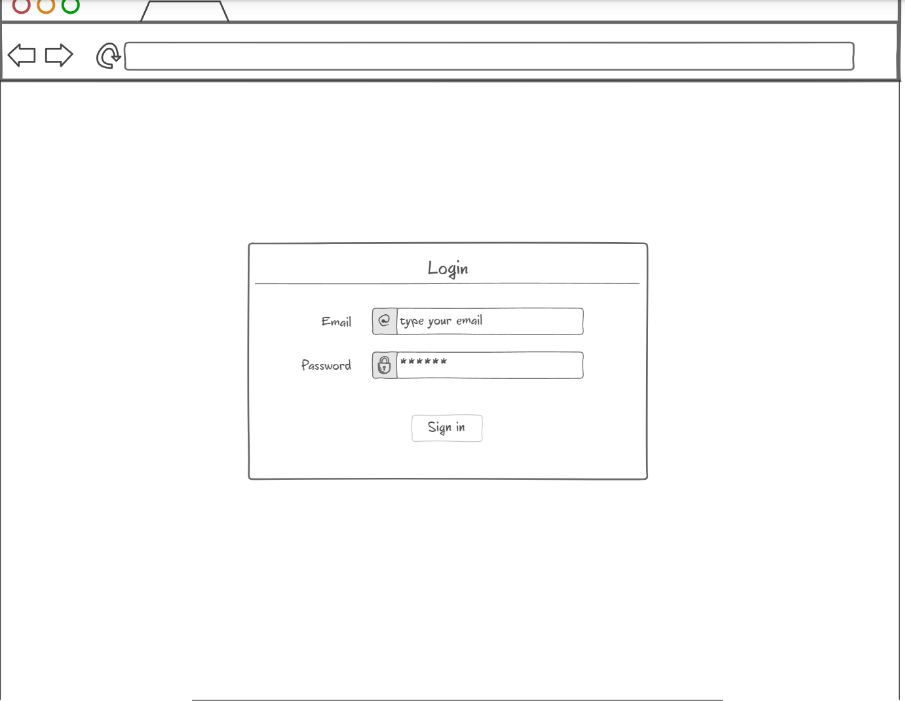

# CS260-Startup

## Elevator pitch
On campus, students put sticky notes in their windows to write messages or draw pictures. My old monitor broke A little while ago so I removed the LCD layer and put it in my window. I am working on setting up a Raspberry Pi that will grab images from a Google Drive and display them on the LCD. I will get bored of picking images and I want some help. In this class, I will make a website where people can upload images. I can then approve or veto the images before they get sent to my Google Drive. From there, the Raspberry Pi can grab them.

## key features
- Secure Login
- Upload images
- Images are persistently stored until I approve or reject them
- Approve or Reject images
- Notify people when their image is accepted or rejected
- See the three most recently approved images

## Technologies
- HTML - Three HTML pages. One for login, one for uploading images, and one for approving/rejecting images.
- CSS - The styling for the webpages. Works on PC and mobile. 
- JavaScript - Processes login, images, and notifications.

## Design images.

